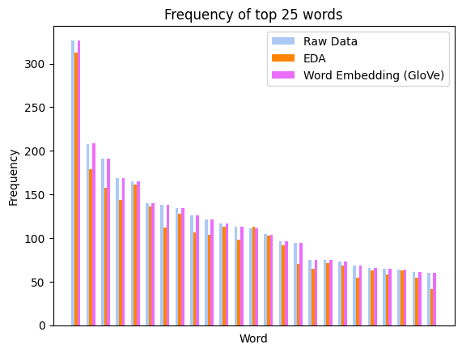
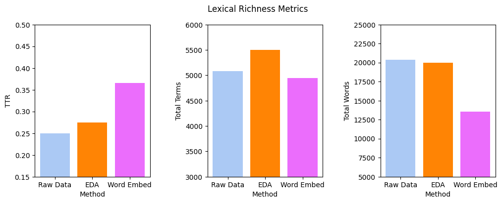
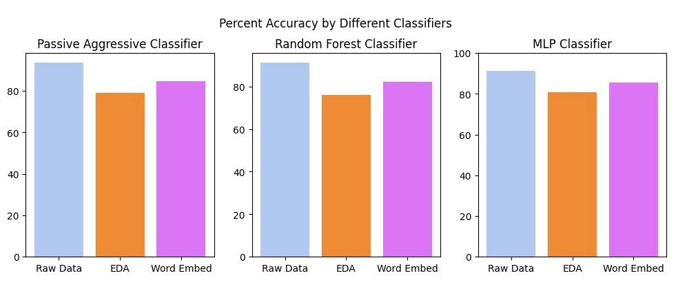

# HateDeception: Using Adversarial Learning to Deceive Hate Speech Detection Models for Twitter

---

## Introduction

Social media platforms like Twitter face the challenge to detect hate speech effectively against mounting malicious tactics. To solve this issue, machine learning models have been developed to detect hate speech; but can they be deceived with another set of machine learning models? Our research consists of two sets of models: attack and defense. Our ”defense” model is a natural language processing (NLP) machine learning model that classifies a string input (such as a tweet) as hate speech or not hate speech, and was trained on a dataset of Twitter posts annotated with those binary labels. The ”attack” models are NLP adversarial learning models which generate posts that aim to evade hate speech detection by deceiving our defense model. With the help of Dr. Yibo Hu, our attack team identified various black-box adversarial learning techniques to modify the tweets in our dataset without changing their original meaning, helping us evaluate the robustness and effectiveness of our defense system in the face of adversarial attacks. Our research aims to first train a defense model with the highest accuracy in detecting hate speech. Then, we attempt to craft an attack model capable of deceiving our defense model with altered inputs that are semantically deceptive (convincing) and 2 accurately deceptive (effective)

---

## Dataset

Choosing a dataset involved evaluating multiple datasets on Kaggle to find one that had the most useful features for training our defense model. We worked with Dr. Yan Zhou and Dr. Latifur Khan to help us chose an appropriate dataset with enough features. One challenge we faced was the subjective nature of our topic, so we had to ensure that the dataset we chose followed Twitter’s user guidelines about what constitutes hate speech and what does not. We were specifically interested in finding a dataset of tweets that were classified only as hate speech or not hate speech, as we were planning to create a binary classification model. We eventually found one based on Twitter guidelines that was labeled for a tertiary classification: hate speech, not hate speech, or offensive language. For our purposes, we cleaned the dataset by removing the ”offensive” label to make it a binary classification model.

---

## Defense Model Methodology

Our defense model had to classify text from our dataset to be either hate speech or non-hate speech with a high accuracy. We used three different models using sklearn libraries, however we the prepared the data the same for all the methods. Since the ratio of hate and non-hate speech text was disproportional, we used random under-sampling to even out the ratio. We then split the random sample where 75% of the data would be used for training the modal, and 25% would be used to test the modal. Next, we tokenized and removed stopwords from the text. Finally, we used a grid search to optimize the hyper parameters when training each model.

1. Linear Model: Uses a Passive Aggressive Classifier. This means that if the prediction is correct,
keep the model (passive). If it is incorrect, make changes to the model (aggressive).
2. Random Forest: Creates a set of decision trees from a subset of the training data. It collects the
predictions from all the decision trees to determine a final prediction.
3. Neural Network: Uses Multi-layer Perceptron classifier that utilizes a feed-forward deep neural
network with backpropagation for classification with PyTorch and Keras.
Metric for Analyzing Performance: To measure each defense model’s performance, we measured
the accuracy rate on how well it correctly identified tweets from the testing dataset as hate speech.

---

## Attack Model Methodology

Our attack model had to generate different variations of the tweets in our dataset using methods from TextAttack [1]: Easy Data Augmentation (EDA) and Word Embedding using Global Vectors for Word Representation (GloVe). These are black-box adversarial learning techniques that heuristically alter the original dataset by replacing, inserting, or deleting words to fool the model.

__Metrics for Analyzing Performance:__ To measure the performance of each model, we __1)__ analyzed the statistical differences of the texts’ semantics between the original, unaltered dataset and the dataset altered by the attack model for similarity, and __2)__ measured how much the altered datasets from each attack decreased the defense model’s original prediction accuracy for effectiveness.

---

## Results

The accuracy of our linear defense model ended up at 93.47%, 91.07% for the random forest model, and 91.45% for the neural network. For further assessment, we used a confusion matrix to visualize how accurate the defense model’s predictions were. Below, the diagonal (from top left to bottom right) represents the frequency of successful predictions made by the linear model

- Out of 1,079 tweets labeled as ”hate,” the modelpredicted 943 correctly, but 93 were incorrect as ”not hate.” Similarly, out of 1,046 tweets labeled as ”not hate,” the model predicted 1,003 correctly, but 43 were incorrect as ”hate.”
- The linear model has a higher accuracy in predicting ”not hate” tweets (96%) compared to ”hate” tweets (90%) but has a higher false negative rate for ”hate” tweets (10%) than for  not hate” tweets (4%). 
- These results suggest that the model may have more difficulty identifying hate speech than non-hate speech tweets, and may need further optimization to improve its performance in identifying hate speech accurately

Along with our defense team’s model accuracy, the attack team ran statistical analyses on the three test datasets of augmented tweets to compare them to the original dataset. The top 25 words that appeared the most in the tweets in the original dataset still appeared just as frequently after Word Embedding. EDA seemed to have less success in this. This may not necessarily be a good or bad thing. It could indicate that the attacks were not effective enough in changing the original meaning. On the other hand, it suggests that attacks were subtle enough to not be detected.

Hateful language is typically predictable, repetitive, and simplistic. Because of this, the attack team expected to have more lexical richness after the three text attacks, as this can suggest that the attacks successfully changed tweets previously detected as hate speech to not hate speech. The only text attack method that seemed to succeed in this was EDA, however

The figure above shows how accurate each text attack method was for each defense model. The attack team aimed to decrease the accuracy as much as possible from the raw data. Although we achieved this, accuracies did not decrease significantly. To fix this, we would have to increase the amount of words to swap or embedded words for each text attack.

---

## References

[1] Hu, Yibo, et al. ”Controllable Fake Document Infilling for Cyber Deception.” Findings of the Association for Computational Linguistics:
EMNLP 2022, Association for Computational Linguistics, 2022, pp. 6505–6519, Abu Dhabi, United Arab Emirates.

--- 

## Contributors

#### Research Lead & Professor mentors 

Christopher Back, Dr. Latifur Khan, Dr. Yibo Hu, Dr. Yan Zhou

#### Attack & Defense Team

Vy Nguyen, Nathan Perez, Jonathan Serrano, Victoria Vynnychok, Joseph Wright
